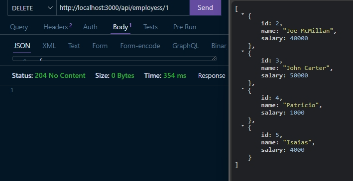

# CRUD de Empleados

Este proyecto es una API para gestionar empleados con las siguientes funcionalidades: agregar, actualizar, eliminar y buscar empleados.

## Funcionalidades

1. **Agregar Empleados**  
   Se puede agregar un nuevo empleado proporcionando un nombre y un salario.

   

2. **Actualizar Empleados**  
   Es posible actualizar la información de un empleado, modificando tanto el nombre como el salario.

   

3. **Buscar Todos los Empleados**  
   Puedes obtener una lista de todos los empleados en la base de datos.

   

4. **Buscar Empleado por ID**  
   También es posible buscar un empleado específico proporcionando su ID.

   

5. **Primera Prueba - Tabla en MySQL**  
   Consulta inicial de los empleados en la base de datos usando MySQL.

   

6. **Eliminar Empleados**  
   Esta funcionalidad te permite eliminar empleados de la base de datos.

   

---

## Tecnologías Utilizadas

- Node.js
- Express.js
- MySQL
- Rest
- Thunder (para pruebas)

